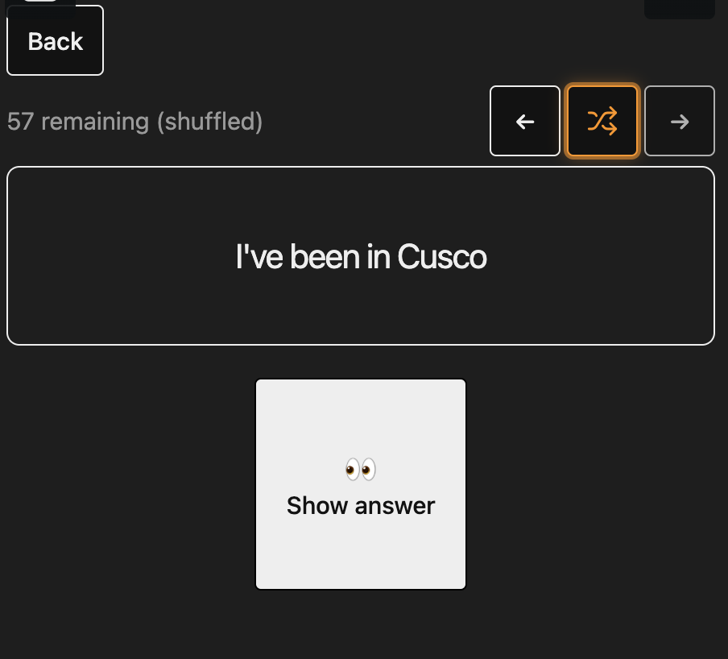
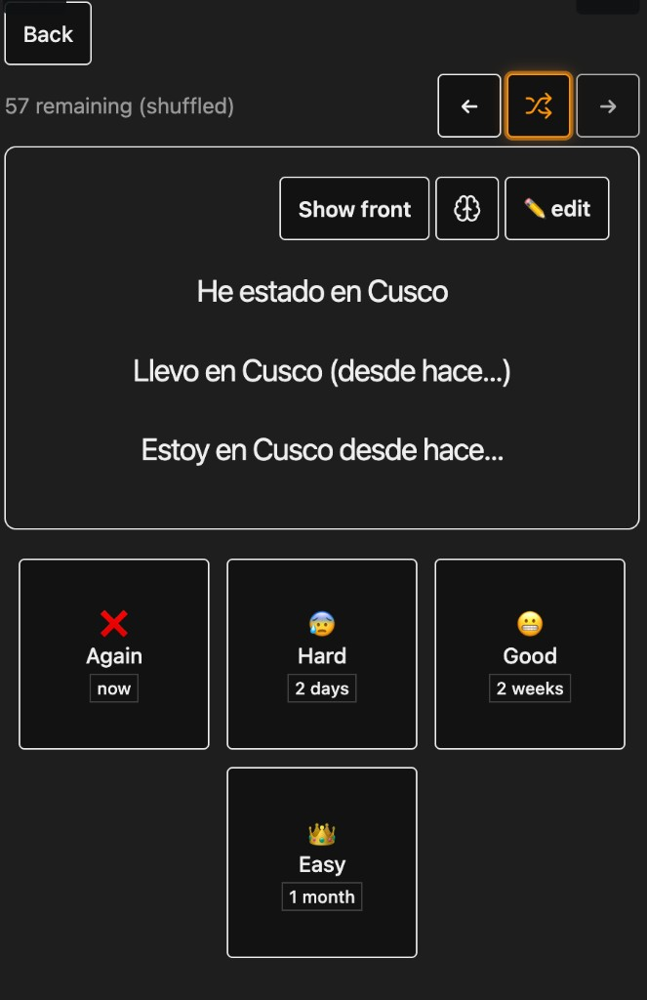
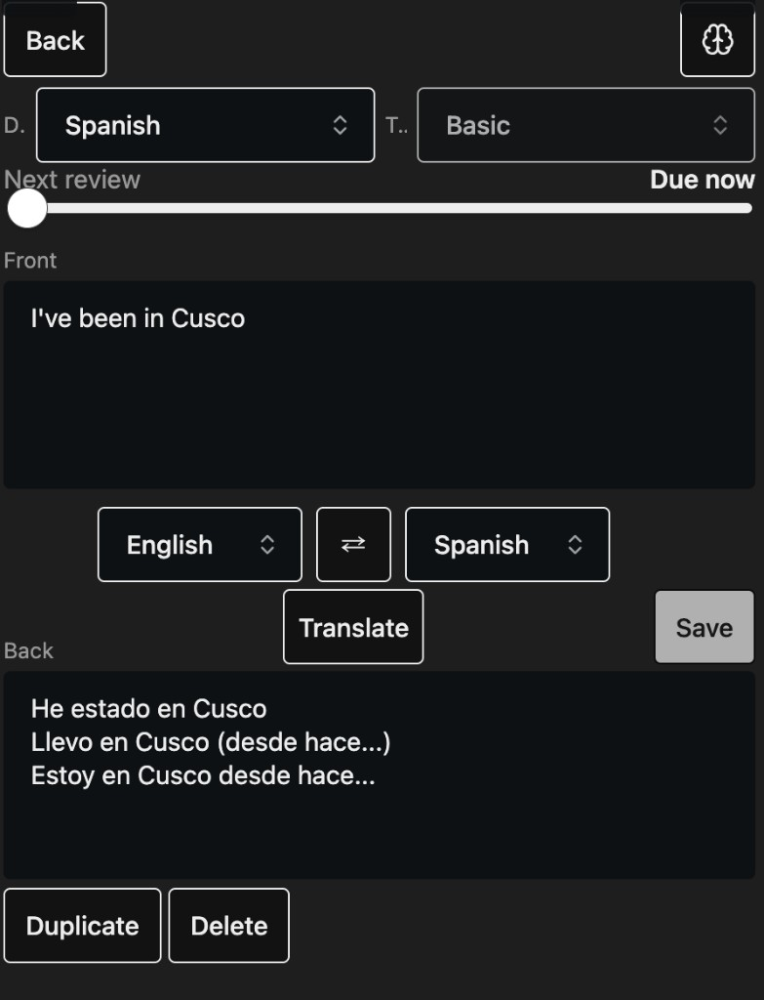
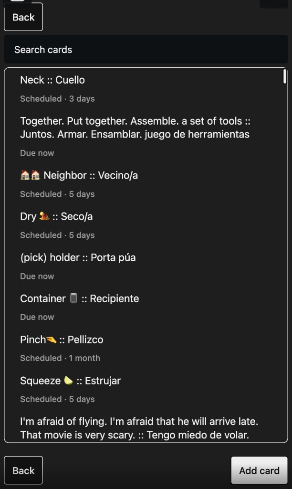
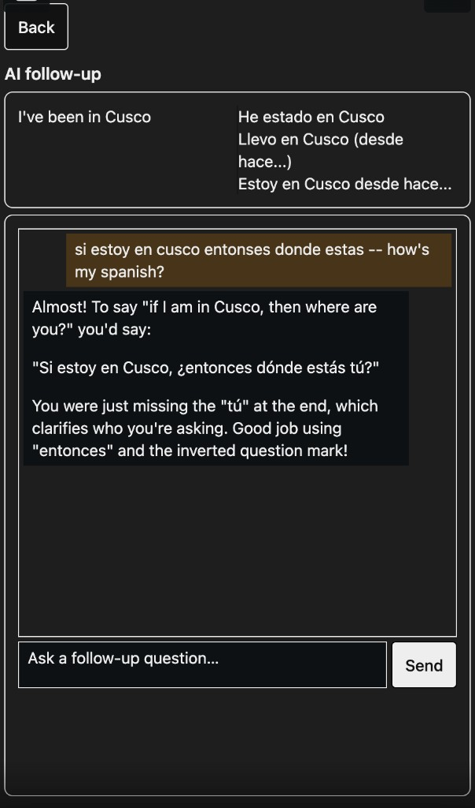
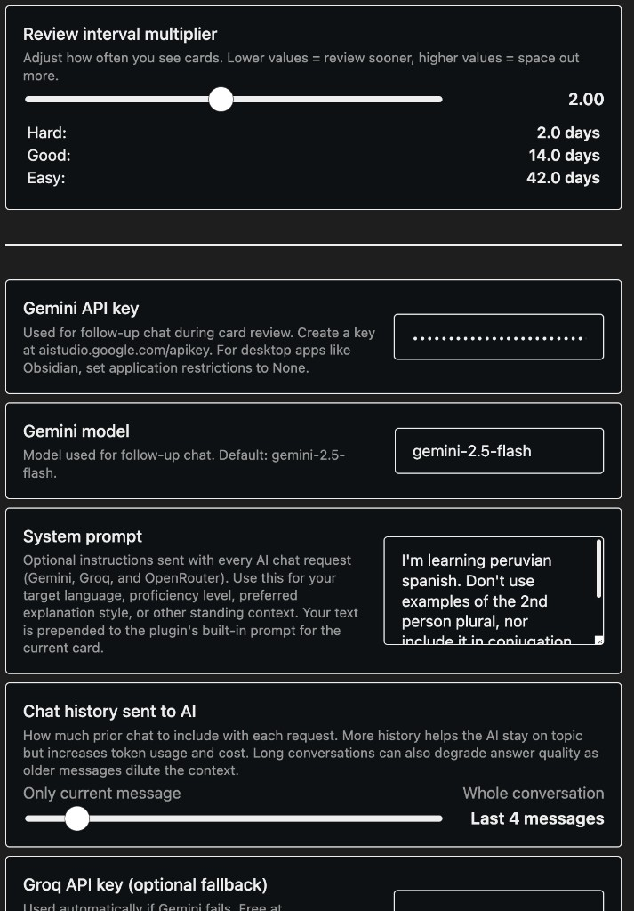

# Language Recall

Anki-style spaced repetition for language learning, built into Obsidian. Create decks, translate cards as you write them, review with SRS scheduling, and chat with an AI tutor when you want to dig deeper. No API key needed for front-to-back translation -- only for the AI tutor screen if you want, and the built-in services are free and easy to setup if you want to opt into using AI for language learning (I have -- it's fantastic!).

Forked from [Obsidian Better Recall](https://github.com/FlorianWoelki/obsidian-better-recall).

## Screenshots

**Decks**


**Review**





**Card editor**



**Search cards**



**AI follow-up**



**Settings**



## Features

- **Decks & cards** — create decks, add basic front/back cards, edit mid-review, search across a deck
- **SRS review** — Again / Hard / Good / Easy with next-review estimates (Anki algorithm)
- **Built-in translation** — translate front → back in the card editor, no API key required
- **AI follow-up** — ask questions after a card; get corrections and explanations in context (Gemini, with Groq/OpenRouter fallback)
- **Tunable** — interval multiplier, system prompt (dialect, level, style), chat history length

## Quick start

1. Open **Recall** from the ribbon or run `Language Recall: Open decks`
2. Create a deck → **Add card** → type the front, hit **Translate**, save
3. **Review** due cards; rate them; tap the brain icon for AI follow-up

For AI follow-up, add a [Gemini API key](https://aistudio.google.com/apikey) in settings. Optional Groq or OpenRouter keys are used as fallbacks. Use the system prompt to steer the tutor — e.g. target dialect, proficiency, things to avoid.

## Development

```sh
git clone https://github.com/ChasKane/language-recall.git
cd language-recall
pnpm install
```

Create `env.mjs` in the project root:

```js
export const obsidianExportPath =
  '<path-to-vault>/.obsidian/plugins/language-recall';
```

```sh
pnpm dev    # watch + copy to vault
pnpm build
pnpm lint
```
