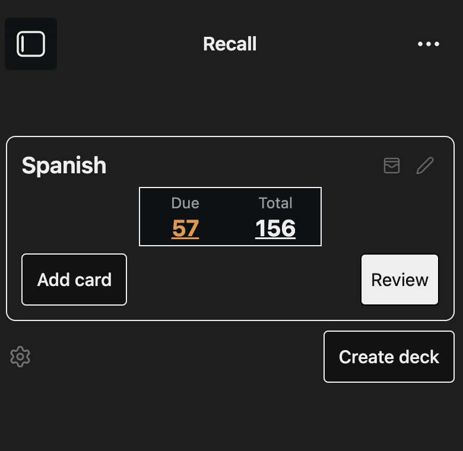

# Language Recall (Obsidian Plugin)


This plugin was forked from [Obsidian Better Recall](https://github.com/FlorianWoelki/obsidian-better-recall) and extended for language learning workflows, including built-in translation while creating and editing cards.

## What is it?

Language Recall gives you a simplified Anki-like spaced repetition workflow directly inside Obsidian.
You can create decks, add/edit/delete cards, review due cards, and translate card content while authoring.

The plugin currently uses:

- [Anki algorithm](https://faqs.ankiweb.net/what-spaced-repetition-algorithm.html)

## Features

- **Deck management**
  - Create decks with optional descriptions
  - Edit deck name/description
  - Delete decks
  - Store deck files in a configurable vault folder (`Language Recall` by default)
- **Card management**
  - Add, edit, and delete basic cards
  - Move a card to a different deck while editing
  - Persist your last selected deck in the card editor
- **Review session**
  - Review cards with `Again / Hard / Good / Easy`
  - See estimated next-review time before answering
  - Edit the current card mid-review, then resume
  - Render card content as Markdown (including Obsidian internal links)
- **Built-in translation**
  - Translate front -> back in the card editor with no API key
  - Select source/target language and swap them quickly
  - Supports common language pairs (English, Spanish, French, German, Italian, Portuguese, Japanese, Chinese, and more)
  - Language choices are persisted between sessions
- **Navigation and commands**
  - Ribbon icon to open decks
  - Commands:
    - `Language Recall: Open decks`
    - `Language Recall: Add card`
  - Back navigation works from UI buttons and `Esc` (including Android hardware-back behavior mapped to Escape in WebView)
- **Settings**
  - Review interval multiplier (`0.25` to `4.0`)
  - Decks folder rename/migration (moves existing deck files)

## How to use it

Quick start:

1. Open decks using the ribbon icon:



2. Or run the command `Language Recall: Open decks`.

3. Create a deck.
4. Add cards from the deck list, deck card, or `Language Recall: Add card`.
5. Start reviewing from a deck's `Review` button.

## Reviewing cards

Click `Review` on a deck to start a session. During review:

- Press `Space` to reveal answer
- Press `1`, `2`, `3`, `4` for `Again`, `Hard`, `Good`, `Easy`
- Use the visible next-review estimates to choose an answer
- Use the edit button to modify the current card and continue

Review timing is adjusted by the configured interval multiplier in plugin settings.

## Data storage notes

- Each deck is stored as its own `.md` file in the configured decks folder.
- Deck files use frontmatter plus serialized card rows.
- The plugin handles deck filenames and migrations automatically when folder settings change.
- Avoid manually moving/renaming individual deck files.


## Development

Clone and install dependencies:

```sh
$ git clone https://github.com/ChasKane/language-recall.git
$ cd language-recall
$ pnpm install
```

Create an `env.mjs` file in the project root:

```js
export const obsidianExportPath =
  '<path-to-obsidian-vault>/.obsidian/plugins/language-recall';
```

Start the dev build/watch:

```sh
$ pnpm dev
```

This builds the plugin and watches for changes. It also copies plugin assets to the configured plugin directory.

Useful scripts:

```sh
$ pnpm lint
$ pnpm build
```
